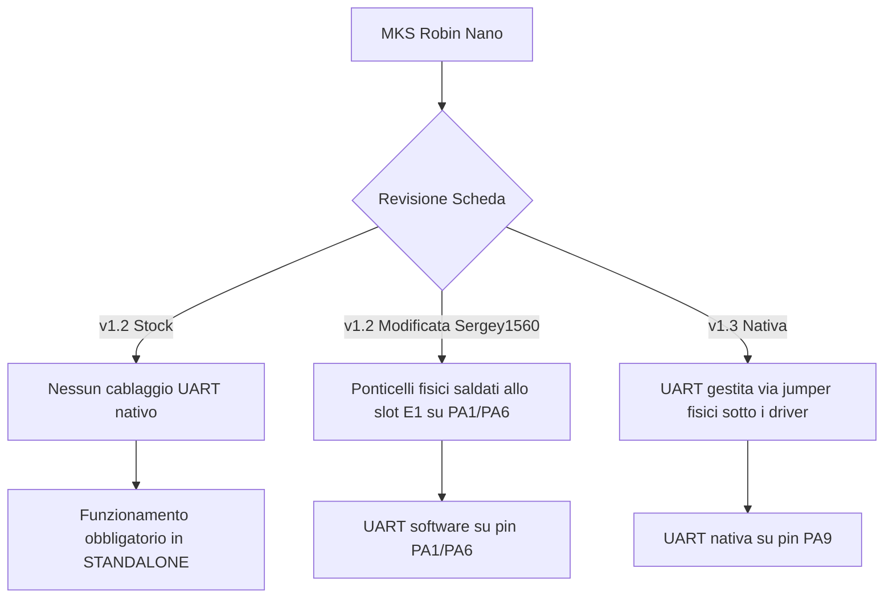

# Diagnostica Driver TMC (UART vs Standalone), Comportamento LCD e Calibrazione Z-Endstop

Questo documento raccoglie la diagnostica tecnica, le soluzioni applicate e le spiegazioni relative a tre problematiche cruciali affrontate sulla tua **Flying Bear Ghost 5** durante il passaggio a **Klipper**:
1. L'errore di comunicazione UART dei driver TMC2209 (`IFCNT`).
2. Lo stato bloccato dello schermo LCD originale.
3. La calibrazione della quota Z tramite finecorsa fisico (senza BLTouch).

---

## 1. Diagnostica Driver TMC2209: Standalone vs UART

Durante la configurazione dei motori, l'attivazione della comunicazione UART via software ha restituito il blocco di Klipper con l'errore:
`Unable to read tmc uart 'stepper_x' register IFCNT`

### Rationale & Architettura Hardware (MKS Robin Nano)
La MKS Robin Nano (v1.2 e v1.3) gestisce i driver X, Y, Z ed E in modo differente a seconda delle revisioni fisiche della scheda:



### Perché l'UART ha fallito sulla tua stampante:
Abbiamo testato entrambi gli scenari di comunicazione UART in Klipper:
*   **Scenario A (Modifica Sergey1560):** Configurando l'UART sui pin `PA1`/`PA6` (associati allo slot estrusore E1 inutilizzato).
*   **Scenario B (Robin Nano v1.3 nativa):** Configurando l'UART sul pin nativo `PA9`.

Entrambi i tentativi hanno restituito l'errore `IFCNT`, confermando che **la tua stampante è configurata fisicamente in modalità Standalone** (assenza di ponticelli fisici UART sotto i driver o assenza di modifiche hardware con saldature).

### Configurazione Standalone Applicata in Klipper:
In modalità Standalone, i driver TMC2209 funzionano come dei driver tradizionali (stile A4988). Klipper non può regolarne la corrente o i registri internamente tramite codice.
*   **Soluzione software:** Abbiamo **commentato** tutte le sezioni `[tmc2209 stepper_...]` nel file `motors.cfg`.
*   **Soluzione hardware (Taratura Corrente):** La regolazione della corrente RMS dei motori deve essere eseguita **manualmente** girando con un cacciavite il trimmer fisico (potenziometro) situato su ciascun driver e misurando la tensione Vref con un multimetro.
    *   *Formula di calcolo per TMC2209 Standalone:*
        $$I_{\text{rms}} = \frac{V_{\text{ref}}}{1.414} \implies V_{\text{ref}} = I_{\text{rms}} \times 1.414$$
    *   *Esempio per estrusore Orbiter v2.5 (consigliato 0.6A RMS in Standalone per evitare surriscaldamenti):*
        $$V_{\text{ref}} = 0.6 \times 1.414 \approx 0.85\text{ V}$$

---

## 2. Comportamento dello Schermo LCD Originale (TFT35)

All'accensione della stampante dopo il flash di Klipper, lo schermo LCD originale mostra la barra di avanzamento del caricamento firmware ferma al **100%** e non risponde ai comandi touch.

### Perché accade questo:
1.  Il firmware stock della Flying Bear gestiva sia la cinematica della stampante sia la grafica dello schermo touch.
2.  **Klipper è un firmware "headless" (senza testa):** gira interamente sul Mini PC/Raspberry Pi. Il microcontrollore STM32 sulla Robin Nano esegue solo un firmware minimale (`klipper.bin`) che riceve ed esegue i comandi di movimento a bassissimo livello inviati dal Mini PC.
3.  Di conseguenza, Klipper disattiva il controllo del display proprietario MKS TFT, che rimane bloccato sull'ultima schermata mostrata dal bootloader (la barra al 100% dopo aver completato la lettura del file `Robin_nano35.bin` dalla SD).

### Come interagire con la stampante:
L'interfaccia utente è interamente spostata sulla rete locale. Puoi controllare la stampante da qualsiasi smartphone, tablet o PC digitando l'indirizzo IP del Mini PC nel browser per accedere all'interfaccia **Mainsail** o **Fluidd**.

---

## 3. Calibrazione Z-Endstop con Finecorsa Fisico (Senza BLTouch)

Un problema comune riscontrato è stato il movimento dell'ugello che spingeva troppo in basso (sotto il piatto o premendo contro di esso) durante la calibrazione assistita delle viti, rispetto all'altezza di Homing.

### Perché accadeva:
Nel file `motors.cfg` originale, il parametro `position_endstop` dell'asse Z era impostato a un valore non calibrato o ereditato da configurazioni con sonda (BLTouch). Se Klipper ha un offset errato, assume che lo zero fisico sia più in basso rispetto a dove fa clic il finecorsa.

### Come funziona la quota Z in Klipper Standalone:
Senza una sonda fisica, lo zero dell'asse Z è determinato unicamente dal punto in cui il piatto tocca fisicamente l'endstop meccanico.

```
       [Ugello] 
          |
   ==============  <-- Piatto (Altezza di stampa Z = 0)
          |
    [Finecorsa Z]  <-- Clic fisico (position_endstop: 0.0)
```

1.  **Impostazione di base:** Abbiamo configurato `position_endstop: 0.0` nel modulo `[stepper_z]` in `motors.cfg`. Questo indica a Klipper che il punto in cui scatta il finecorsa corrisponde esattamente alla quota Z = 0.
2.  **Calibrazione meccanica iniziale:** Regola manualmente la vite che preme sul finecorsa Z (sul retro della stampante) in modo che, quando l'asse Z fa l'homing, l'ugello si trovi a circa 0.1 mm dal piatto nei quattro angoli.
3.  **Calibrazione fine dello Z-Offset (Paper Test):**
    *   Riscalda ugello e piatto alle temperature di esercizio.
    *   Esegui l'homing: `G28`.
    *   Digita in console il comando di calibrazione dello z-offset di Klipper:
        ```gcode
        Z_ENDSTOP_CALIBRATE
        ```
    *   La stampante si posizionerà al centro del piatto. Esegui il test del foglio di carta muovendo l'ugello tramite i pulsanti su Mainsail o digitando comandi come `TESTZ Z=-0.1` o `TESTZ Z=+0.05`.
    *   Quando avverti il giusto attrito sul foglio di carta, clicca su **ACCEPT** e poi scrivi:
        ```gcode
        SAVE_CONFIG
        ```
    *   Klipper salverà l'offset calibrato nel fondo del file `printer.cfg` modificando dinamicamente il valore di `position_endstop`.
